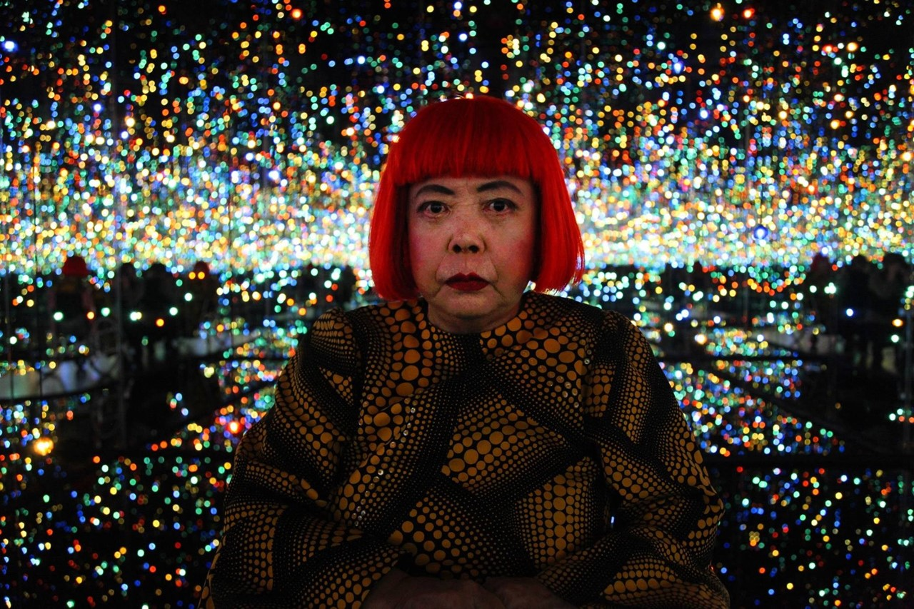
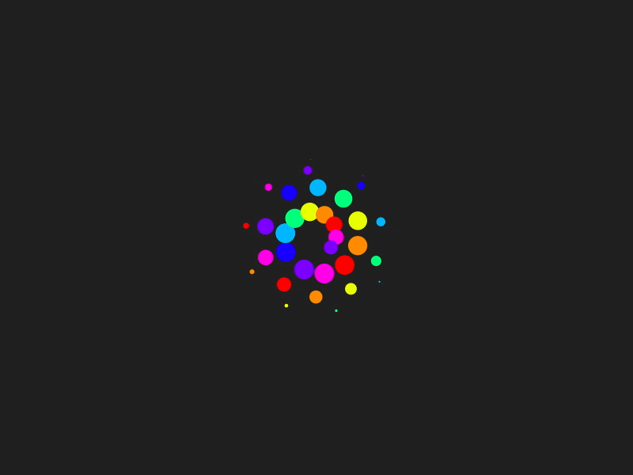

# Quiz 8

## Part 1: Imaging Technique Inspiration

**Inspiration Source: Yayoi Kusama – Infinity Mirrored Room: Love Forever (2014)**

Yayoi Kusama's immersive rooms use mirrored repetition and polka-dot motifs to generate sensory complexity and spatial expansion. I’m inspired by her use of color repetition and layering to reimagine Pacita Abad’s *Wheels of Fortune* as dynamic, rhythmically patterned digital forms that reflect cultural symbolism and variation.

*Yayoi Kusama, Infinity Mirrored Room – Love Is Calling (2013)*

*Yayoi Kusama, Infinity Mirrored Room – Love Is Calling (2013)*

## Part 2: Coding Technique Exploration

**Technique**: Array Functions in p5.js  
**Reference**: [p5.js Array Functions Tutorial](https://happycoding.io/tutorials/p5js/array-functions)

Array functions allow me to efficiently generate repeated circular forms with controlled randomness—mimicking Kusama's modular repetition and Abad's rhythmic dot systems. Each "wheel" becomes a unique object with variations in color, size, and density.

  
*Array-based object pattern*

*Array-based object pattern 2*

[> Link tutorial and code example](https://happycoding.io/tutorials/p5js/array-functions)
